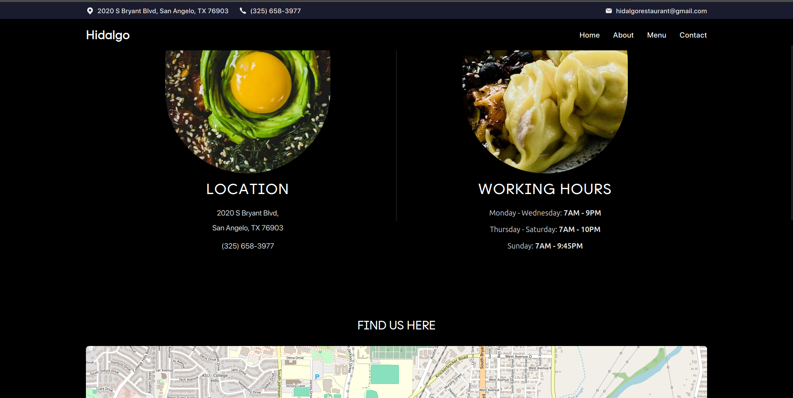

# Modern Restaurant Website

  

## 🍽️ About The Project

A modern restaurant design, responsive website for a restaurant that showcases its menu, ambiance, and services. The website is designed to provide an immersive experience for visitors, allowing them to explore the restaurant's offerings, read customer reviews, and make reservations.

## ✨ Live Demo

  <a href="https://rococo-tartufo-745e98.netlify.app/" target="_blank">
    

      
      

        <h2 style="margin: 0;">Hidalgo's Restaurant - Live Demo</h2>
        <svg width="24" height="24" viewBox="0 0 24 24" fill="none" xmlns="http://www.w3.org/2000/svg">
          <path d="M18 13v6a2 2 0 0 1-2 2H5a2 2 0 0 1-2-2V8a2 2 0 0 1 2-2h6" stroke="#000" stroke-width="2" stroke-linecap="round" stroke-linejoin="round"/>
          <path d="M15 3h6v6" stroke="#000" stroke-width="2" stroke-linecap="round" stroke-linejoin="round"/>
          <path d="M10 14L21 3" stroke="#000" stroke-width="2" stroke-linecap="round" stroke-linejoin="round"/>
        </svg>
      

    

  </a>

## 📸 Screenshots

  
  

  
  

## 🚀 Features

- **Responsive Design**: Fully responsive layout that works on mobile, tablet, and desktop devices
- **Interactive Menu**: Beautifully designed menu with filtering options
- **Customer Reviews**: Display and submission of customer reviews
- **About Page**: Information about the restaurant's history and values
- **Contact Page**: Contact information with interactive map
- **Animations**: Smooth animations and transitions using Framer Motion
- **Image Carousel**: Dynamic image carousel showcasing the restaurant's ambiance
- **Video Content**: Engaging video content with play button overlay for an interactive experience

## 📱 Pages

### Home

- Hero section with image carousel
- Restaurant introduction
- Featured menu items
- Customer testimonials

### Menu

- Complete food menu with categories
- Appetizers, Salads, Mexican Dinners, Fajitas, Steaks, and more
- Beautiful food imagery

### Order Online

- Interactive food ordering interface
- Filter options for different food categories

### Reviews

- Customer reviews and ratings
- Option to add new reviews

### About

- Restaurant history and story
- Team information
- Restaurant values and mission

### Contact

- Location information with interactive map
- Contact form
- Business hours

## 🛠️ Built With

- [React](https://reactjs.org/) - Frontend library
- [TypeScript](https://www.typescriptlang.org/) - Type safety
- [Vite](https://vitejs.dev/) - Build tool and development server
- [TailwindCSS](https://tailwindcss.com/) - Utility-first CSS framework
- [Framer Motion](https://www.framer.com/motion/) - Animation library

## 📝 License

Distributed under the MIT License. See `LICENSE` for more information.
